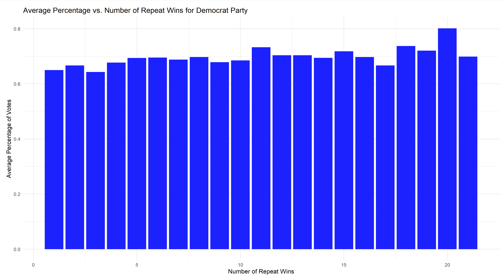
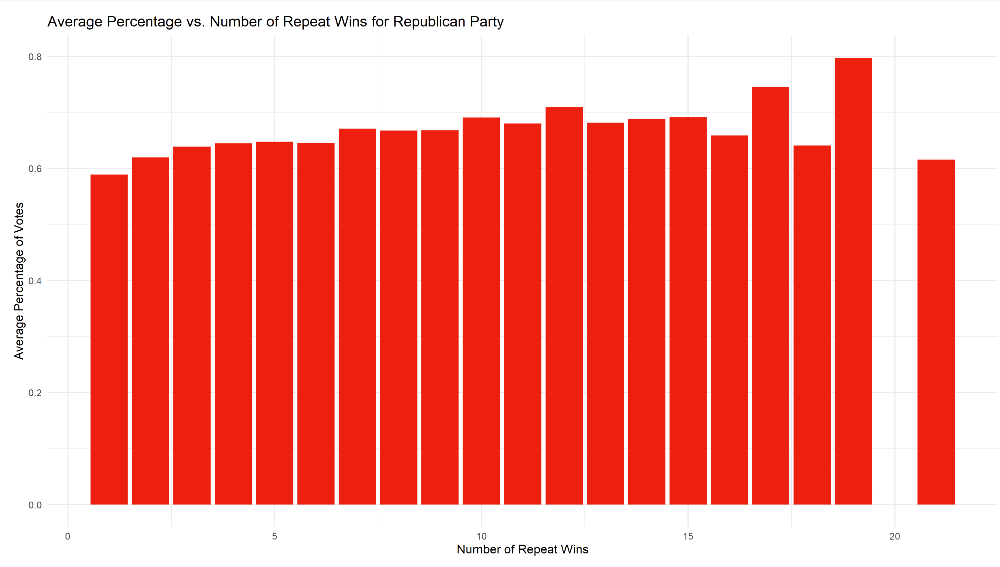
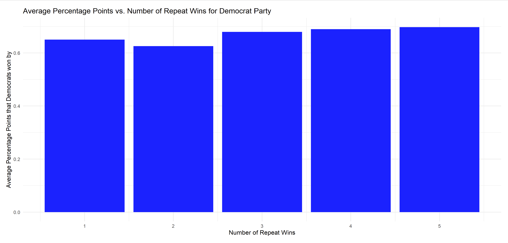
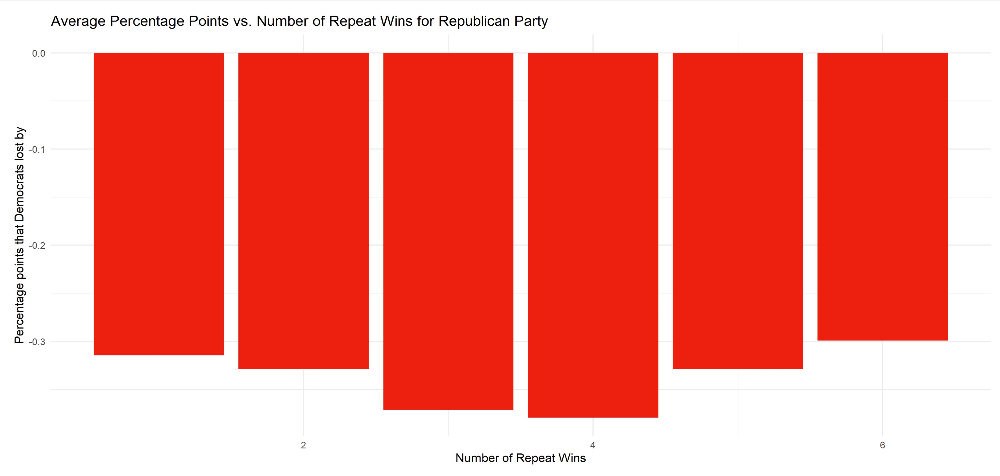

# Group 1 - Project 1, Predicting House Election Results 
## Table of Contents
- SRC
  - This folder contains all of the source code for our project. Currently, this folder contains the code that was used to clean the house dataset and combine it with the biographical dataset.
- DATA
  - This folder is where we store all datasets being used for this project. Specifically it contains both the raw datasets and cleaned versions that will be used in the final analysis.
- Figures
  - Currently this folder is empty; however, as the project progresses it will be filled with all of the figures generated by our analysis.

## SRC
### Installing/ Building our code
### Usage

## DATA
### Dictionary
| Column Name | Definition | 
| -------- | -------- |
| year | year in which the election was held |
| state | Full name of candidate state |
| district | This column displays the district number (ranging from 1 - 435). It is important to note that at-large districts are coded as 0 |
| democrat_votes | votes received by this candidate for the Democratic party |
| republican_votes | votes received by this candidate for this Republican party |
| totalvotes | total number of votes cast for this election |
| democrat_candidate | The name of the Democratic candidate as it appears in the House Clerk report |
| republican_candidate | The name of the Republican candidate as it appears in the House Clerk report |
## Figures
| Figure | Takeaways | 
| -------- | -------- |
|  | year in which the election was held |
|  | year in which the election was held |
|  | year in which the election was held |
|  | year in which the election was held |

## References
[1] Biographical Directory of the United States Congress. Biographical Directory. United States Congress.
[Online]. Available: https://bioguide.congress.gov/search

[2] MIT Election Data and Science Lab, 2022, "U.S. House 1976–2022".
[Online]. Available: https://doi.org/10.7910/DVN/IG0UN2, Harvard Dataverse, V12, UNF:6:A6RSZvlhh8eRZ4+mvT/HRQ== [fileUNF]

### Previous Work
- MI-1: https://docs.google.com/document/d/14slMy6rfthzj-fg_Ci6QtaI9SSjmyC3pHbzZSMs6yFs/edit?usp=sharing
- MI-2: https://docs.google.com/document/d/16aHZvSn3PNeamnEEEplk4Cjra7g0ENP0EYV7q1gQ1mo/edit?usp=sharing
### Acknowledgements
We would like to thank Professor Alonzi and Harsh Anand for supporting us throughout this project. We greatly appreciate all of the feedback and guidance they have provided and owe part of our success in completing this assignment to them!
