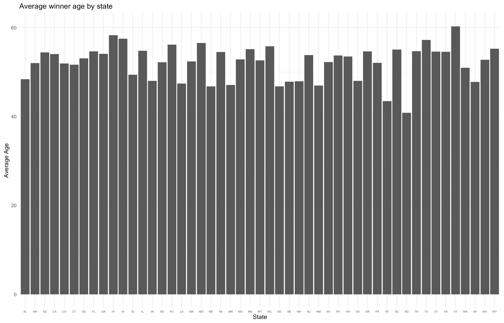
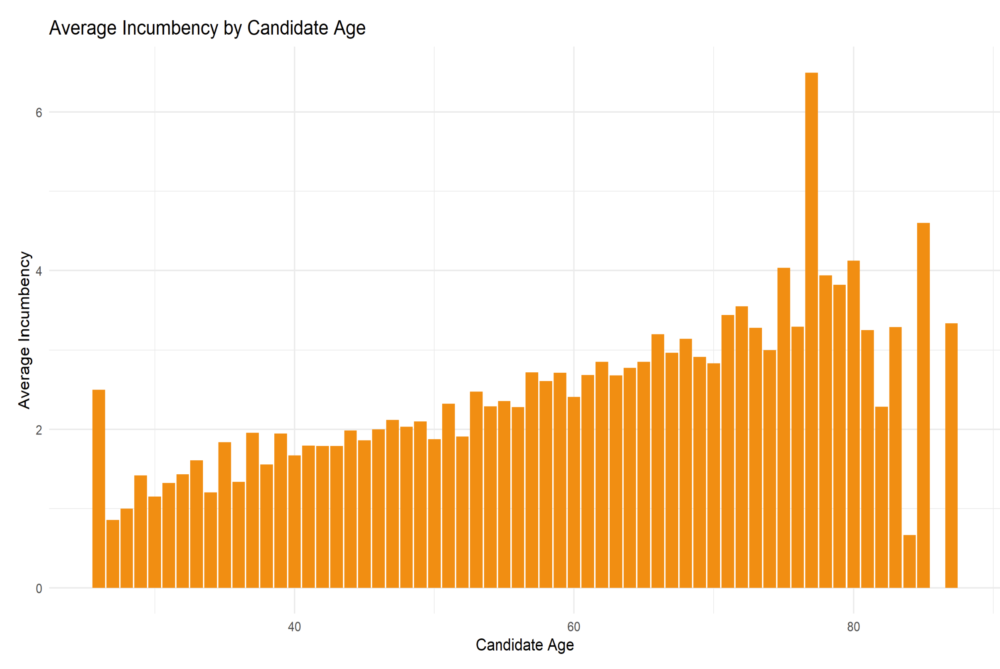
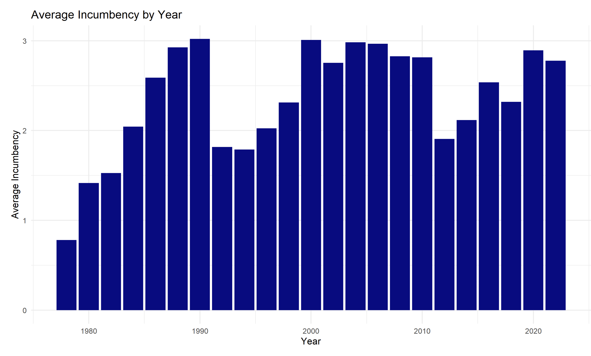

# Group 1 - Project 1, Predicting House Election Results 
## Table of Contents
- SRC
  - This folder contains all of the source code for our project. Currently, this folder contains the code that was used to clean the house dataset, create new columns to calculate the lean margin, election winner, and visualize these trends. It also includes the archive of our final model
- DATA
  - This folder is where we store all datasets being used for this project. Specifically it contains both the raw datasets and cleaned versions that will be used in the final analysis.
- Figures
  - Currently this folder contains exploratory plots looking into how incumbency impacts the amount of votes a candidate receives as well as how incumbency relates to the amount of percentage points that a candidate will win by broken down by party. As we move forward with our analysis, we will include figures as they relate to the final model.

## SRC

### Installing/ Building our code
- It is recommended to run the notebook files in an IDE that supports both Jupyter Notebooks and R markdown files such as Pycharm.
- These files use the 'tidyverse' and 'dplyr' R libraries and the json, re, pickle, numpy, pandas and sklearn Python libraries
- File paths may be incorrect on your machine, you are recommended to check all file paths before running.

### Notebook Files
| Notebook Name | Decription |
| -------- | -------- |
| handle_biographic.ipynb | This notebook cleans the raw biographic dataset |
| house_clean.Rmd | This notbook cleans the house elections dataset |
| name_matching.ipynb | This notbook combines the two datasets, handles edge cases, and produces the training dataset |
| model_training.ipynb | This notebook uses sklearn to train and tune a random forest regressor model |
| project1_visuals.Rmd | This notebook creates all of the exploratory plots utilizing the training data set |
  
### Usage
To use this model, first unpickle it. Then call the sklearn method predict(data) to get predictions.

## DATA
- Note: The data dictionary is split into three sections. The first two sections are based on the original source of the data and defines columns that were used in calculations to create the final dataset (election dataset vs. biographical dataset). The third section includes all the columns included in the training dataset that is used in the final analysis and model.

### Datasets
| Dataset Name | Description |
| -------- | -------- |
| house.csv | This is the raw data of the 1976-2022 U.S. House of Representatives elections. |
| house_biographic.csv | This is the raw data of the biographical directory of the U.S. House of Representatives. |
| house_clean.csv | This is the cleaned version of house.csv |
| house_leans_recent.csv | This is U.S. House of Representative data from 2012-2020 including the average percentage point margins that the democratic party won by in all the districts. |
| training.csv | This is the csv that is used to train the model. It is the result of combining the elections and biographic datasets, and only includes the columns that are relevant to model training. |
  
### Election Dataset Dictionary
| Column Name | Definition | 
| -------- | -------- |
| year | year in which the election was held |
| state | Full name of candidate state |
| district | This column displays the district number (ranging from 1 - 435). It is important to note that at-large districts are coded as 0 |
| democrat_votes | votes received by this candidate for the Democratic party |
| republican_votes | votes received by this candidate for this Republican party |
| totalvotes | total number of votes cast for this election |
| democrat_candidate | The name of the Democratic candidate as it appears in the House Clerk report |
| republican_candidate | The name of the Republican candidate as it appears in the House Clerk report |

### Biographical Dataset Dictionary
| Column Name | Definition | 
| -------- | -------- |
| UnaccentedGivenName | unaccented first name of the candidate |
| UnaccentedFamilyName | unaccented last name of the candidate |
| congressNumber | unique identifer for candidate to distinguish within the same state |
| stateName | U.S. postal code state abbreviation |
| parties | Political party affiliation (either Democrat or Republican) |
| electionYear | Year during with the candidate ran for House of Representatives |
| ageDuringElection | Age of candidate when elected (calculated by subtracting electionYear from birthYear) |

### Training Dataset Dictionary
| Column Name | Definition | 
| -------- | -------- |
| year | Election year |
| state | U.S. postal code state abbreviation |
| previous_winner_age | Age of the winner of the last election at the time |
| incumbent | Name of party who won the election |
| incubency_count | Incremental count of the amount of continuous elections won by a political party |
| avg_dem_margin_4 | Average dem margin of the last 4 elections |
| avg_total_votes_4 | Average number of votes for the last 4 elections |
| party_flips_4 | Number of times there was a party switch in the previous 4 elections |
| dem_margin | Label that we are predicting, but this column contains the actual dem_margin for that year and state |

## Figures
| Figure | Takeaways | 
| -------- | -------- |
|  | This plot was used during the exploratory phase of this project and uses data from all years. Specifically, the bar graph shows the relationship between the average percentage that a Democratic candidate won the house election by and the number of times they have been re-elected. This was found by counting the number of times a candidate name was repeated, saving that value to a column, and then averaging the percentage_votes for all candidates re-elected the same number of times. We found that there is not a huge difference in the percentage of votes they bring in; however, there is a very slight positive trend that peaks at 20. |
|  | Similar to the previous figure, this figure was used for exploratory data analysis. The plot was created in the same manner as the first figure; however, it was filtered to only look at Republican candidates. This plot shows a stronger trend than with the Democratic party as there is a more clear positive trend between the percentage of votes a candidate gets and how many times they are elected. |
|  | After looking more into the data, it is clear that we must subset the data so that there are consistent district lines between all elections. Therefore, this plot utilizes data from 2012-2020 with the number of repeated wins on the x-axis and democratic margin on the y-axis. The y-axis is found by finding  the total number of votes and then dividing the democratic votes by that amount. Therefore, we are able to see that a Democratic candidate wins by the highest amount of percentage points the more they are re-elected with an exception at two times.|
|  | This figure mirrors the previous figure; however, this time we are looking at the Republican party. Therefore, a negative number will represent this group and indicate the percentage points that the democratic party lost by. We were able to see that interestingly enough, candidates who are reelected three and four times have the greatest margin, mimicing more of a bell curve. |
|  | This figure is utilizing the trained data set to find the average winner age for each state. We were able to group all winners in each state and average the age for all the winning representatives. This plot shows that the average winner age for all states is above 40 years old. |
|  | This figure is utilizing the trained data set to find the average incumbency by candidate age. We were able to average the incumbency count after grouping the data by candidate_age. This plot showed what we expected in the sense that as age increased the incumbency count also increased. There were two notable spikes around 25 and 75 years old which was interesting; however, after the age of 80 there was a steep decline which is probably coorelated to candidate retirement. |
|  | This figure is utilizing the trained data set to find the average incumbency by election year. We were able to average the incumbency count after grouping the data by year. This plot shows a really interesting trend as the bar graph takes on a step shape where there is a steady increase in incumbeny count that resets every census. It is important to note the limitations of our data as it only shows 1976-2022.  |

## References
[1] Biographical Directory of the United States Congress. Biographical Directory. United States Congress.
[Online]. Available: https://bioguide.congress.gov/search

[2] MIT Election Data and Science Lab, 2022, "U.S. House 1976–2022".
[Online]. Available: https://doi.org/10.7910/DVN/IG0UN2, Harvard Dataverse, V12, UNF:6:A6RSZvlhh8eRZ4+mvT/HRQ== [fileUNF]

### Previous Work
- MI-1: https://docs.google.com/document/d/14slMy6rfthzj-fg_Ci6QtaI9SSjmyC3pHbzZSMs6yFs/edit?usp=sharing
- MI-2: https://docs.google.com/document/d/16aHZvSn3PNeamnEEEplk4Cjra7g0ENP0EYV7q1gQ1mo/edit?usp=sharing
### Acknowledgements
We would like to thank Professor Alonzi and Harsh Anand for supporting us throughout this project. We greatly appreciate all of the feedback and guidance they have provided and owe part of our success in completing this assignment to them!
